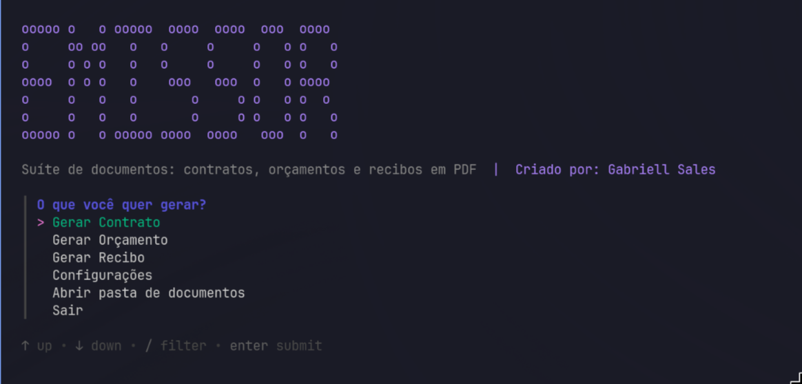
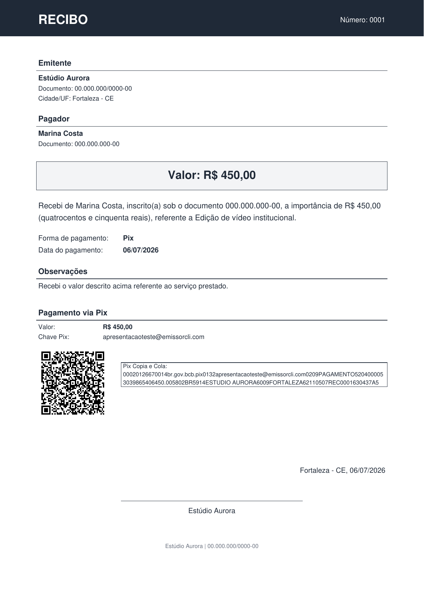
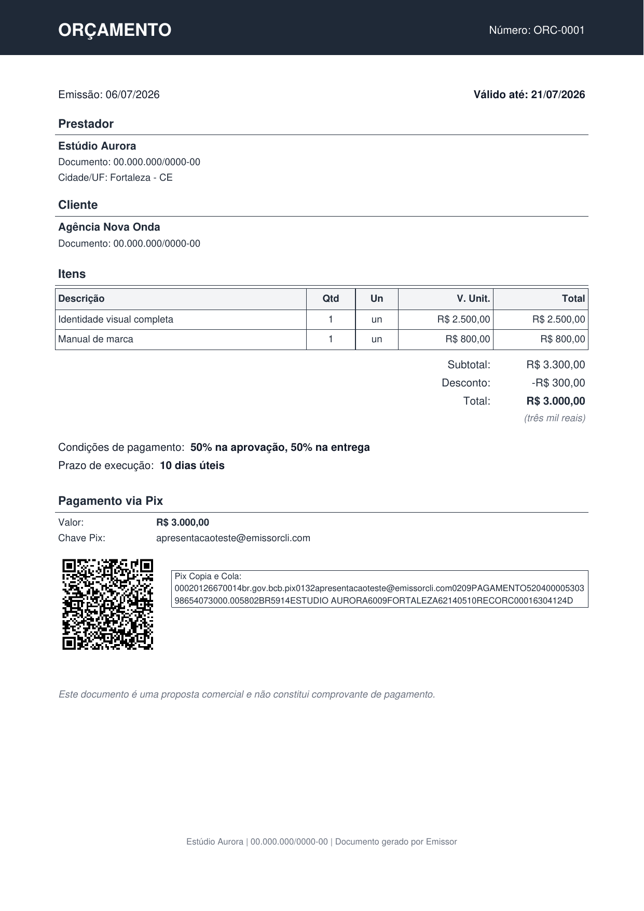
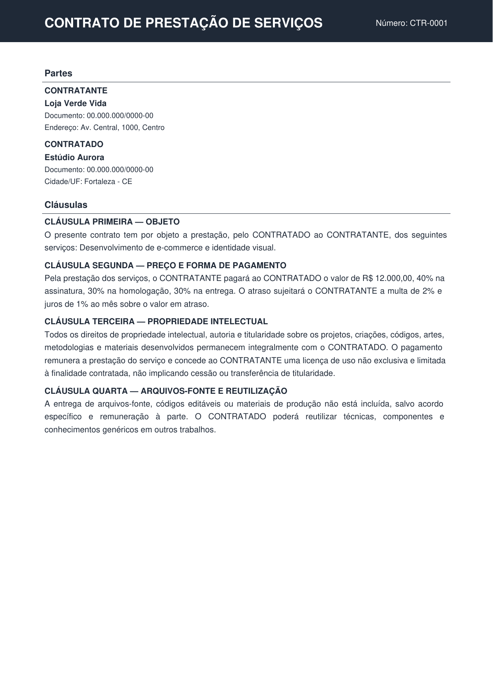
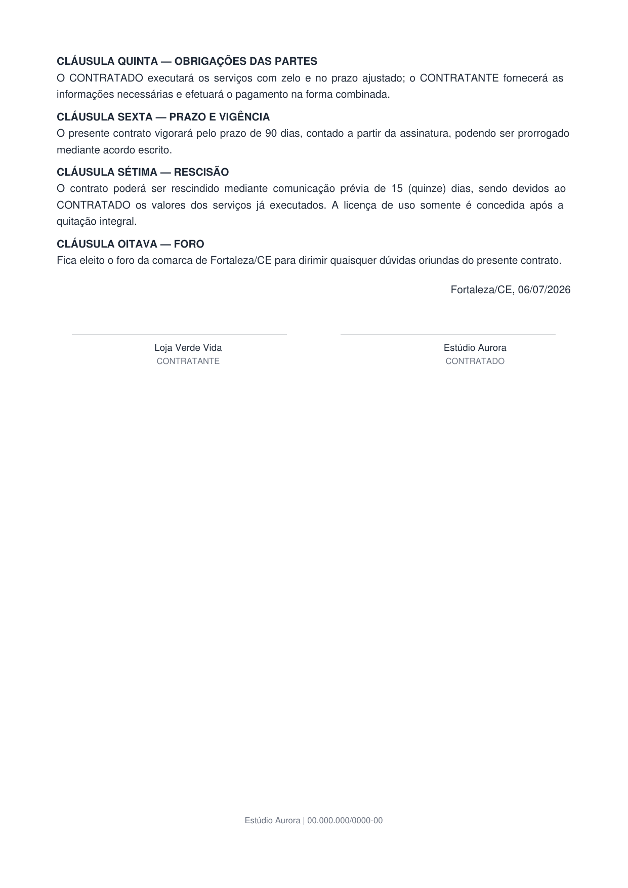

# Emissor

Suíte de documentos em **Go** para gerar **contratos, orçamentos e recibos** em **PDF**
direto do terminal, com metadados em JSON, histórico local e **QR Code Pix estático
offline** (valor, chave e Pix Copia e Cola).

Abra o terminal, digite `emissor-cli`, escolha o documento, responda algumas perguntas e
receba um PDF bonito e organizado automaticamente. Funciona **offline**, sem depender de
internet, navegador, Word, planilhas ou qualquer runtime externo.



```
✅ Recibo gerado com sucesso!

Arquivo:
~/Documentos/Emissor/Recibos/2026/07/03/recibo-20260703-153012-0001.pdf
```

---

## Exemplos

Exemplos gerados pela própria suíte (dados fictícios).

### Recibo — com Pix offline (QR Code + Copia e Cola)



### Orçamento — itens, desconto, total e validade



### Contrato — modelo "propriedade intelectual do prestador"

 

---

## Documentos

- **Contrato** — contrato de prestação de serviço, com cláusulas numeradas e **3 modelos**
  prontos para escolher na hora da criação:
  - *Prestação de serviço (equilibrado)* — justo para a maioria dos casos, protege o
    prestador quanto a pagamento, escopo e rescisão;
  - *Propriedade intelectual do prestador* — o projeto/obra continua do prestador; o
    cliente recebe apenas licença de uso;
  - *Cessão de direitos ao cliente (work for hire)* — os direitos passam ao cliente após o
    pagamento integral.
- **Orçamento** — proposta comercial com tabela de itens, subtotal, desconto, total,
  valor por extenso e validade.
- **Recibo** — comprovante de pagamento recebido, com Pix offline.

---

## Recursos

- Geração de PDF profissional pelo terminal para os três documentos.
- Menu principal (Contrato / Orçamento / Recibo) e submenu próprio por documento.
- Assistente interativo no primeiro uso (menus com setas via `charmbracelet/huh`).
- Configuração do emitente reaproveitável (pessoa física ou empresa/MEI).
- Valor por extenso automático.
- **Pix offline**: QR Code estático, Pix Copia e Cola e CRC16 calculados localmente.
- Organização automática por tipo e data (`ano/mês/dia`) com nome de arquivo único.
- Histórico local em JSON, com comandos para listar e abrir documentos.
- Multiplataforma: Linux, Windows e macOS.

---

## Instalação

Os comandos abaixo baixam o binário pronto (do GitHub Releases) e instalam sem exigir
Go instalado.

### Linux e macOS (curl)

```bash
curl -fsSL https://raw.githubusercontent.com/gabriellsalesx/Emissor_CLI/main/scripts/install.sh | sh
```

Instala em `~/.local/bin/emissor-cli`. Se essa pasta não estiver no seu `PATH`, o script
avisa como adicioná-la.

### Windows (PowerShell)

```powershell
irm https://raw.githubusercontent.com/gabriellsalesx/Emissor_CLI/main/scripts/install.ps1 | iex
```

Instala em `%LOCALAPPDATA%\Programs\Emissor\emissor-cli.exe` e adiciona a pasta ao `PATH`
do usuário.

### A partir do código-fonte (qualquer sistema com Go)

```bash
git clone https://github.com/gabriellsalesx/Emissor_CLI.git
cd Emissor_CLI
go build -o emissor-cli ./cmd/emissor-cli
```

Depois mova o binário para uma pasta do seu `PATH` (ex.: `~/.local/bin`).

---

## Como remover

### Linux e macOS

```bash
curl -fsSL https://raw.githubusercontent.com/gabriellsalesx/Emissor_CLI/main/scripts/uninstall.sh | sh
```

Remove o binário **e** a configuração/metadados (`~/.config/emissor`). Seus PDFs em
`~/Documentos/Emissor` **não** são apagados.

Remoção manual:

```bash
rm ~/.local/bin/emissor-cli       # binário
rm -rf ~/.config/emissor          # configuração + metadados (JSON e QR Codes)
# Seus PDFs em ~/Documentos/Emissor NÃO são apagados.
```

### Windows (PowerShell)

```powershell
irm https://raw.githubusercontent.com/gabriellsalesx/Emissor_CLI/main/scripts/uninstall.ps1 | iex
```

Remoção manual:

```powershell
Remove-Item "$env:LOCALAPPDATA\Programs\Emissor" -Recurse -Force
Remove-Item "$env:APPDATA\Emissor" -Recurse -Force   # configuração + metadados
```

---

## Como começar (primeiro uso)

Execute:

```bash
emissor-cli
```

Na primeira vez, a CLI detecta que não há configuração e abre o assistente para cadastrar
o emitente (nome, documento, cidade/UF, chave Pix, etc.). Esses dados ficam salvos e são
reaproveitados nos próximos documentos.

Depois disso, `emissor-cli` sem argumentos abre o **menu principal**:

```txt
? O que você quer gerar?
  > Gerar Contrato
    Gerar Orçamento
    Gerar Recibo
    Configurações
    Abrir pasta de documentos
    Sair
```

Navegue com as setas e confirme com Enter. Cada documento abre seu próprio submenu (novo,
listar, abrir, etc.). Quando a entrada vem de um pipe/script, a CLI usa um fallback por
números para preservar a automação.

---

## Comandos

| Comando | O que faz |
|---|---|
| `emissor-cli` | Abre o menu principal (ou o assistente inicial no primeiro uso). |
| `emissor-cli config` | Edita os dados do emitente, Pix, pasta de saída e padrões. |
| `emissor-cli config ver` | Mostra um resumo da configuração atual. |
| `emissor-cli pasta` | Mostra (e tenta abrir) a pasta de documentos. |
| `emissor-cli pix config` | Configura chave Pix, QR Code, Copia e Cola e exibição no PDF. |
| `emissor-cli pix testar --valor 10,00` | Gera um Pix Copia e Cola e um QR Code de teste. |
| `emissor-cli recibo` | Submenu de recibo. |
| `emissor-cli recibo novo` | Cria um novo recibo (interativo ou por argumentos). |
| `emissor-cli recibo listar [--abrir] [--links]` | Lista recibos recentes. |
| `emissor-cli recibo abrir 0001` | Abre o PDF do recibo pelo número. |
| `emissor-cli orcamento novo` | Cria um novo orçamento. |
| `emissor-cli orcamento listar` / `abrir` | Lista/abre orçamentos. |
| `emissor-cli contrato novo` | Cria um novo contrato (escolhendo o modelo). |
| `emissor-cli contrato listar` / `abrir` | Lista/abre contratos. |

### Gerar recibo por argumentos (automação)

```bash
emissor-cli recibo novo \
  --emitente "Minha Empresa" --emitente-cidade Fortaleza --emitente-uf CE \
  --pagador "João Silva" --valor "250,00" --referente "Desenvolvimento de site" \
  --pagamento Pix --data 03/07/2026 --sim
```

### Formatos aceitos

- **Valor:** `250`, `250,00`, `250.00`, `1.250,00`, `1250.00`.
- **Data:** `hoje`, `ontem`, `DD/MM/AAAA` ou `AAAA-MM-DD`.
- **Validade (orçamento):** além das datas acima, aceita `N dias` (ex.: `15 dias`).
- **Chave Pix:** e-mail, CPF, CNPJ, telefone (`+55...`) ou aleatória.

---

## Onde os arquivos ficam

**PDFs** (o que o usuário vê), organizados por tipo e data:

```
~/Documentos/Emissor/
├── Contratos/2026/07/03/contrato-20260703-153012-0001.pdf
├── Orcamentos/2026/07/03/orcamento-20260703-160000-0001.pdf
└── Recibos/2026/07/03/recibo-20260703-153012-0001.pdf
```

No Windows: `%USERPROFILE%\Documents\Emissor\...`.

**Metadados** (JSON e PNG do QR Code) ficam separados na pasta interna da aplicação:

```
~/.config/emissor/metadata/{receipts|orcamentos|contratos}/...   # Linux
%APPDATA%\Emissor\metadata\{receipts|orcamentos|contratos}\...    # Windows
```

**Configuração:**

```
~/.config/emissor/config.json    # Linux
%APPDATA%\Emissor\config.json      # Windows
```

Cada tipo de documento tem numeração própria; documentos existentes nunca são sobrescritos.

---

## Privacidade

Todos os dados ficam **locais**. Nada é enviado para servidores externos, não há
telemetria e o QR Code Pix é gerado **offline**. A confirmação do pagamento continua
dependendo do app do banco.

> O contrato gerado é um **modelo-base editável** e não constitui aconselhamento jurídico.

---

## Desenvolvimento

```bash
go test ./...
go build -buildvcs=false -o /tmp/emissor-cli ./cmd/emissor-cli
```

### Arquitetura

O núcleo de negócio é desacoplado da CLI, com um módulo por tipo de documento sobre um
núcleo compartilhado — pronto para reuso futuro por MCP, API local ou interface gráfica.

- `internal/core`: tipos compartilhados — `Money` (centavos), `Party`, `PixPayment`,
  datas, valor por extenso e `DocType`.
- `internal/receipt`, `internal/quote`, `internal/contract`: modelos, validação e regras
  específicas de cada documento (o contrato inclui os modelos de cláusulas).
- `internal/pix`: BR Code Pix (EMV), CRC16, normalização, validação e QR Code.
- `internal/pdf`: geração de PDF por documento, independente da CLI.
- `internal/storage`: paths por tipo/data, escrita segura e histórico local.
- `internal/config`: configuração local em JSON.
- `internal/app`: orquestra os casos de uso (recibo, orçamento e contrato).
- `internal/cli`: comandos (Cobra), menu e prompts.
- `internal/platform`: abertura de arquivos/pastas por sistema operacional.

Rode todos os testes com `go test ./...`.

---

## Licença

Software livre licenciado sob a **GNU Affero General Public License v3.0 (AGPL-3.0)** —
veja o arquivo [`LICENSE`](LICENSE).

Copyright (C) 2026 Gabriell Sales

- Você pode usar, estudar, modificar e redistribuir o software livremente.
- Qualquer versão **modificada e distribuída** deve permanecer open-source, sob a mesma
  licença (AGPL-3.0), preservando os créditos do autor.
- Se o software for oferecido a terceiros **através de uma rede**, o código-fonte da sua
  versão também deve ser disponibilizado aos usuários.
